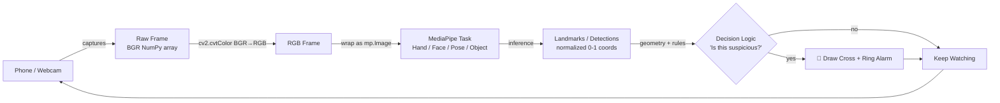
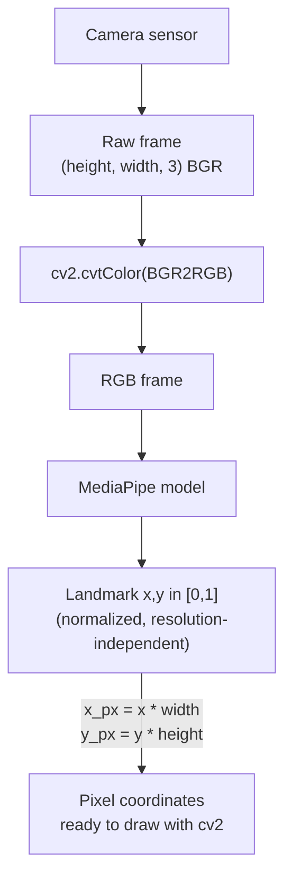
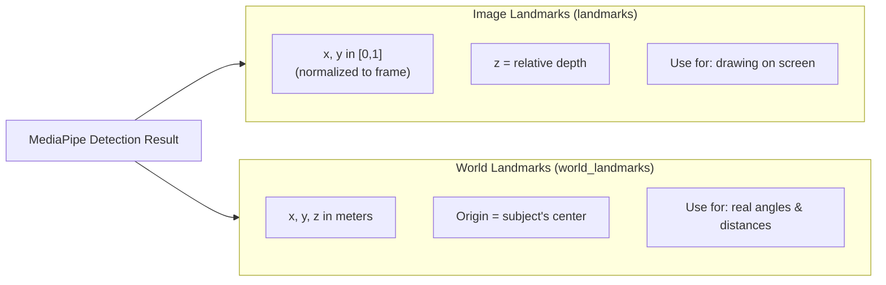
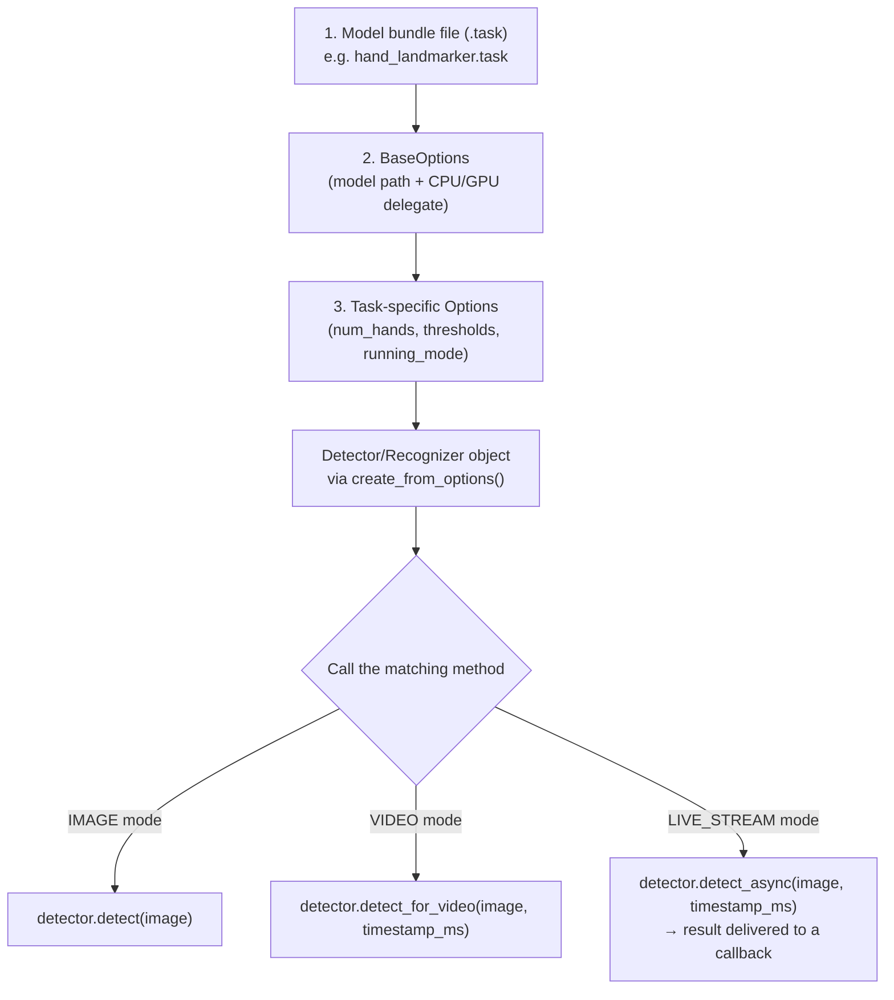
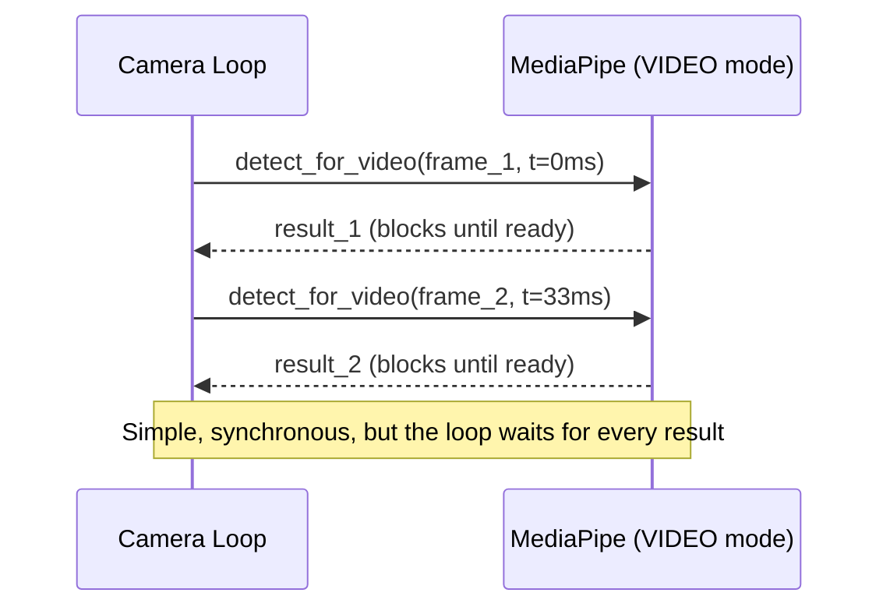
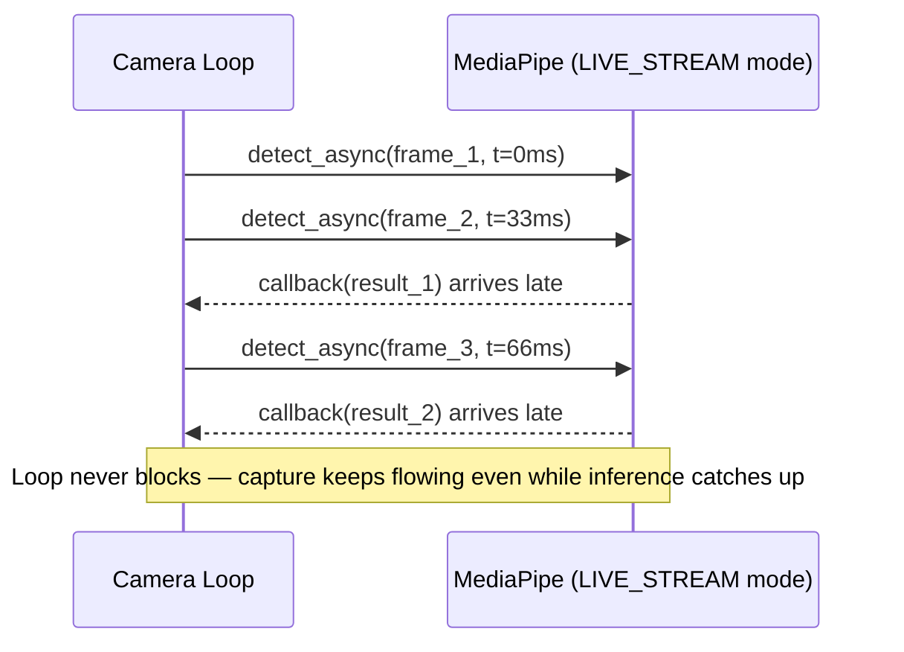
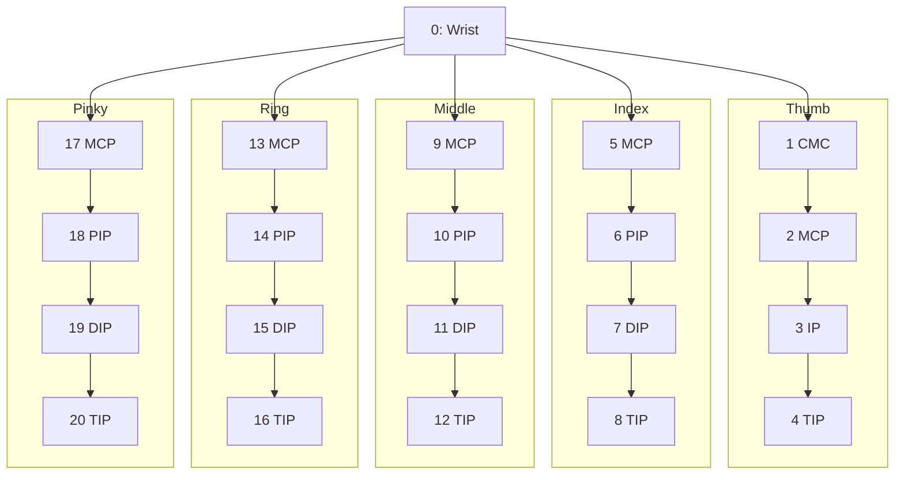
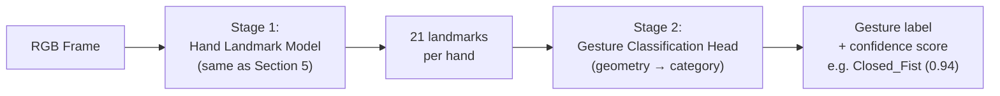
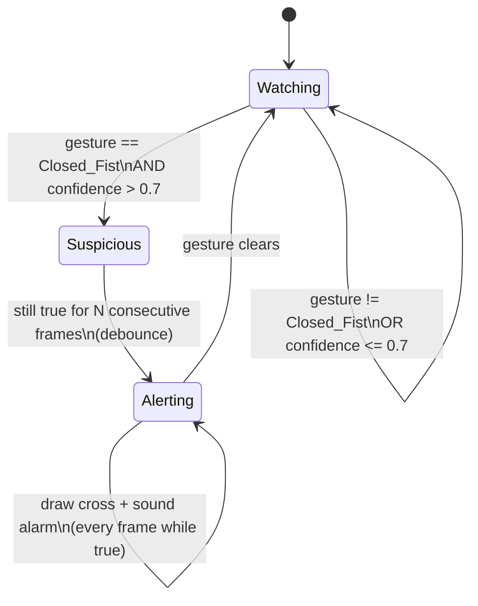
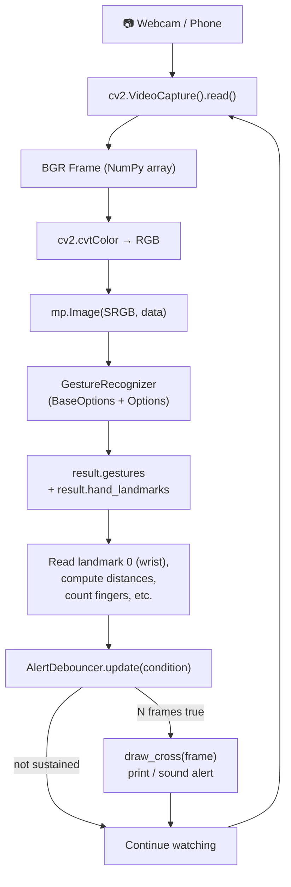

# MediaPipe From First Principles — Part 1
## Frames → Landmarks → Hand Tracking → Gesture Recognition

**By Gita — SEED ML**

------------------

> This is Document 1 of a 3-part series building toward a real capstone system: a **classroom monitoring tool** that captures live video from a phone, streams it to an office laptop, detects suspicious behavior (like a student passing/copying something or turning to look at a neighbor's paper), draws a marker (a "cross"/X) over the flagged student, and rings an alarm on the office computer.
>
> - **Doc 1 (this one):** Frames → Landmarks → Hand Landmarker → Gesture Recognition
> - **Doc 2:** Face Mesh → Full-Body Pose Detection → Selfie Segmentation/Augmentation → Object Detection
> - **Doc 3:** Capstone projects, including the classroom-cheating-alarm system
>
> Everything here has been checked against Google's current (2026) MediaPipe **Tasks API** documentation. The old `mp.solutions.hands` / `mp.solutions.face_mesh` API you might see in older tutorials still runs, but it is the **legacy API** — deprecated since MediaPipe Solutions launched in 2023. We will use the modern **Tasks API** (`mediapipe.tasks.python.vision`) throughout, because that is what Google actively maintains and documents today.

---

### The big picture, in one diagram



This loop — **capture → convert → detect → decide → react** — is the entire capstone system in one picture. Every section below fills in one box.

---

## 0. How This Document Is Structured

Each section follows the same rhythm:

1. **Concept** — explained from first principles, no assumed prior knowledge.
2. **Why it matters for our capstone** — tying it back to the classroom-alarm system.
3. **Code** — a working, minimal example.
4. **Mini-project** — a small hands-on task to cement the idea.
5. **Checkpoint questions** — answer these before moving on. (Answers are yours to write — teaching yourself to explain a concept is how it sticks.)

---

## 1. Setting Up Your Environment

Before touching any code, get a clean, reproducible environment. Do this once.

```bash
# 1. Create a virtual environment (keeps this project's packages isolated)
python -m venv mp-env

# 2. Activate it
# On Windows:
mp-env\Scripts\activate
# On macOS/Linux:
source mp-env/bin/activate

# 3. Install the core packages we need for this whole 3-part series
pip install mediapipe opencv-python numpy
```

A few real, verified facts so you don't waste time chasing ghosts:

- **`mediapipe`** on PyPI is the official package. As of 2026 the actively developed line is `0.10.x` (e.g., `0.10.21` and newer). Always just run `pip install mediapipe` — you'll get a current, working build, unless you're on an unsupported platform.
- **Supported platforms**: 64-bit Python on Windows, macOS, and Linux (x86_64). MediaPipe's PyPI wheels do **not** ship pre-built `aarch64` (ARM64) wheels for Linux — this matters if you plan to eventually deploy the "office laptop" logic on something like a Raspberry Pi. For a Raspberry Pi you either build from source or use their documented ARM workaround. If your office laptop is a normal Windows/Mac/Intel-Linux machine, you're fine out of the box.
- **`opencv-python`** gives us `cv2`, which we use for reading webcam/video frames, drawing shapes (our future "cross" marker), and displaying windows.
- If you ever see `ERROR: Could not find a version that satisfies the requirement mediapipe`, it almost always means your Python version, OS, or architecture isn't in the supported list above — not that MediaPipe is broken.

Verify your install:

```python
import mediapipe as mp
import cv2
print("MediaPipe version:", mp.__version__)
print("OpenCV version:", cv2.__version__)
```

### Checkpoint questions
1. Why do we use a virtual environment instead of installing packages globally?
2. Name one platform where `pip install mediapipe` will NOT give you a pre-built wheel.
3. What two Python packages did we install, and what does each one give us?

---

## 2. What Is a Frame? (First Principles)

A **video** is not one continuous thing — it's an illusion built from a rapid sequence of **still images**, shown one after another fast enough that your brain perceives motion. Each one of those still images is a **frame**.

### 2.1 A frame is just a grid of numbers

Zoom into any frame and you'll find it's made of tiny colored squares called **pixels** (picture elements), arranged in a grid — say, 1920 pixels wide by 1080 pixels tall (this is "1080p"). Every pixel stores a color, and color is almost always represented as three numbers: how much **Red**, **Green**, and **Blue** light to mix (RGB), each typically ranging from 0–255.

So a single color frame is really a 3D array of numbers:

```
frame.shape = (height, width, channels)
# e.g. (1080, 1920, 3)
```

That's it. There's no magic — a "frame" is a NumPy array of integers. Once you internalize this, everything MediaPipe does makes more sense: it's just math running on grids of numbers.

### 2.2 BGR vs RGB — a classic gotcha

OpenCV, for historical reasons, reads and stores color frames as **BGR** (Blue, Green, Red) instead of RGB. MediaPipe's models, however, expect **RGB**. If you forget to convert, your detections will still often "work" on skin-tone-based tasks by accident, but colors will look wrong when you display things, and some models will perform worse. Always convert:

```python
rgb_frame = cv2.cvtColor(bgr_frame, cv2.COLOR_BGR2RGB)
```

### 2.3 Frame rate (FPS) and why it matters for our project

**FPS (Frames Per Second)** is how many frames are captured/processed per second. A typical phone camera streams at 24–30 FPS. For our classroom-alarm system, this matters a lot:

- If our detection pipeline (hand/pose/gesture models) is slower than the incoming frame rate, frames pile up and the "alarm" reacts late — bad for a real-time monitoring system.
- We'll need to measure our own processing FPS and possibly downscale the frame (e.g., resize from 1920×1080 to 640×360) before running detection, trading a little accuracy for a lot of speed.

### 2.4 Coordinate systems: pixel space vs normalized space

Two ways to describe "where" something is in a frame:

- **Pixel coordinates**: exact pixel positions, e.g., `(x=812, y=430)`, dependent on the frame's resolution.
- **Normalized coordinates**: `x` and `y` scaled to the range `[0.0, 1.0]`, where `(0,0)` is the top-left corner and `(1,1)` is the bottom-right — **independent of resolution**.

MediaPipe reports almost all of its landmark output in **normalized coordinates**. This is deliberate: it lets the same detection result apply whether your frame came from a 480p webcam or a 4K phone camera. You will constantly convert normalized → pixel coordinates to actually draw something:

```python
pixel_x = int(normalized_x * frame_width)
pixel_y = int(normalized_y * frame_height)
```

Forgetting this conversion is the #1 beginner bug — drawings ending up squished in the top-left corner of the screen.



### 2.4b Extra code: downscaling frames for speed

Real-time performance is a constant tension: bigger frames look nicer and detect small details better, but they're slower to run inference on. A very common pattern — especially once we're juggling multiple models in Doc 2/3 — is to detect on a **smaller copy** of the frame and scale the results back up:

```python
import cv2

def resize_for_inference(frame, target_width=640):
    h, w = frame.shape[:2]
    scale = target_width / w
    target_height = int(h * scale)
    small_frame = cv2.resize(frame, (target_width, target_height))
    return small_frame, scale

# Usage:
frame = cv2.imread("classroom.jpg")
small_frame, scale = resize_for_inference(frame, target_width=640)

# Because MediaPipe landmarks are normalized [0,1], the SAME normalized
# landmark works for both the small frame and the original frame —
# just multiply by the ORIGINAL frame's width/height when drawing back
# onto the full-resolution image. This is the payoff of normalized coords!
h_orig, w_orig = frame.shape[:2]
# pixel_x_on_original = landmark.x * w_orig
# pixel_y_on_original = landmark.y * h_orig
```

**Key insight:** because MediaPipe gives you *normalized* coordinates, you can run detection on a small, fast copy of the frame and still draw results accurately onto the full-resolution original — you never need to "unscale" pixel math, just re-multiply by whichever frame's dimensions you want to draw on.

### 2.5 Mini-project 1: Build a "Frame Inspector"

Goal: get comfortable capturing and inspecting live video before any ML enters the picture.

```python
import cv2
import time

cap = cv2.VideoCapture(0)  # 0 = default webcam
prev_time = 0

while cap.isOpened():
    success, frame = cap.read()
    if not success:
        print("Failed to grab frame")
        break

    # Frame is a numpy array: (height, width, channels)
    h, w, c = frame.shape

    # Calculate live FPS
    curr_time = time.time()
    fps = 1 / (curr_time - prev_time) if prev_time else 0
    prev_time = curr_time

    # Overlay info directly on the frame
    cv2.putText(frame, f"Resolution: {w}x{h}", (10, 30),
                cv2.FONT_HERSHEY_SIMPLEX, 0.7, (0, 255, 0), 2)
    cv2.putText(frame, f"FPS: {int(fps)}", (10, 60),
                cv2.FONT_HERSHEY_SIMPLEX, 0.7, (0, 255, 0), 2)

    cv2.imshow("Frame Inspector", frame)
    if cv2.waitKey(1) & 0xFF == ord('q'):
        break

cap.release()
cv2.destroyAllWindows()
```

**Task:** Change `cv2.VideoCapture(0)` to point at a phone stream later (Doc 3 covers streaming a phone camera to a laptop via IP webcam / RTSP). For now, just get your webcam FPS and resolution printing live.

### Checkpoint questions
1. What NumPy shape would a 720p (1280×960... actually 1280×720) color frame have?
2. Why does MediaPipe report landmark positions as normalized coordinates instead of pixel coordinates?
3. If your webcam captures at 30 FPS but your detection model can only process 10 frames per second, what are two ways you could fix that mismatch?

---

## 3. What Is a Landmark?

A **landmark** is a single, meaningful **keypoint** that a model has learned to locate on a specific structure — a knuckle, an eye corner, a shoulder, a wrist. Instead of MediaPipe trying to understand "this is a hand" as one blob, it predicts a fixed, ordered **set** of points that together describe the structure's shape and pose.

### 3.1 Two flavors of landmarks

MediaPipe vision tasks typically return **two** parallel sets of points per detected object:

| Type | Meaning | Coordinate range |
|---|---|---|
| **Image landmarks** (`landmarks`) | Position within the 2D image frame | `x, y` normalized to `[0, 1]`; `z` is relative depth (roughly, distance from the wrist/hip, smaller = closer to camera) |
| **World landmarks** (`world_landmarks`) | Position in real-world 3D space, in meters, centered around the geometric center of the detected object | `x, y, z` in meters, origin at the subject's center |

- Use **image landmarks** when you want to draw on the video (they map directly to pixels).
- Use **world landmarks** when you want to measure real angles, distances, or build 3D logic (e.g., "is the hand held higher than the shoulder in actual space" regardless of how close the person is to the camera).

### 3.2 Landmarks are numbered and ordered — always

This is crucial and non-obvious the first time you see it: landmark index `0` for a hand is **always the wrist**, index `4` is **always the thumb tip**, and so on — every single detection, every frame, every person. This fixed ordering is what lets you write simple, deterministic logic like "if landmark 8 (index fingertip) is above landmark 6 (index PIP joint), the finger is extended" instead of having to re-detect "which point is which" every frame.



### 3.2b Extra code: printing both landmark types side by side

Seeing the raw numbers once is worth more than any explanation. Run this on a single hand-landmark result to build intuition for the difference between the two coordinate spaces:

```python
def print_landmark_comparison(result):
    """Prints image-space vs world-space coordinates for the wrist (landmark 0)
    and the middle fingertip (landmark 12) of the first detected hand."""
    if not result.hand_landmarks:
        print("No hand detected.")
        return

    img_lms = result.hand_landmarks[0]        # normalized [0,1]
    world_lms = result.hand_world_landmarks[0]  # meters, real-world scale

    for idx, name in [(0, "Wrist"), (12, "Middle fingertip")]:
        il = img_lms[idx]
        wl = world_lms[idx]
        print(f"{name}:")
        print(f"  Image  -> x={il.x:.3f}, y={il.y:.3f}, z={il.z:.3f}  (normalized)")
        print(f"  World  -> x={wl.x:.3f}, y={wl.y:.3f}, z={wl.z:.3f}  (meters)")
```

Notice: image-space `y` grows *downward* (0 = top of frame), while world-space uses a more conventional 3D coordinate system centered on the hand itself. Mixing these two up is a common source of "my angle math is backwards" bugs.

### 3.3 Why this matters for our capstone

The entire classroom-alarm idea rests on landmarks: we'll track a student's **pose landmarks** (Doc 2) to see if they're turning toward a neighbor, and their **hand landmarks** (this doc) to see if they're passing something or signaling. Landmarks turn "a picture of a person" into a small set of numbers we can write `if` statements against. That's the whole trick of this entire toolkit.

### Checkpoint questions
1. What's the difference between `landmarks` and `world_landmarks`?
2. If you wanted to check whether a student's wrist is above their shoulder regardless of how far they are sitting from the camera, which landmark type would you prefer, and why?
3. Why is it useful that landmark index numbers are consistent across every detection?

---

## 4. The MediaPipe Tasks Architecture (Understand This Once, Reuse Everywhere)

Every single vision task in modern MediaPipe (Hand Landmarker, Face Landmarker, Pose Landmarker, Gesture Recognizer, Object Detector — all of Doc 1 and Doc 2) follows the **exact same pattern**. Learn it once here and you will recognize it in every task going forward.

### 4.1 The three building blocks

1. **A model bundle file** (`.task` extension, sometimes `.tflite`) — a pre-trained neural network Google has already trained and packaged for you. You don't train these from scratch; you download and load them.
2. **A `BaseOptions` object** — tells MediaPipe where the model file lives and which "delegate" to run on (`CPU` or `GPU`).
3. **A task-specific `Options` object** and its matching **detector/recognizer class** — configures behavior (e.g., max number of hands to detect, confidence thresholds) and gives you the object you call `.detect()` on.

This three-step shape is worth memorizing as a diagram, because you will type a version of it for every task in this series:



### 4.2 The three running modes

Every task can run in one of three modes, and picking the right one matters a lot for a real-time system like ours:

| Mode | Use case | Behavior |
|---|---|---|
| `IMAGE` | Single static images | Every call is independent, no memory between frames |
| `VIDEO` | Pre-recorded video files, processed frame-by-frame in order | Uses timestamps to reason about frame order; slightly better temporal smoothing |
| `LIVE_STREAM` | Real-time camera/webcam feeds | Asynchronous — you provide a callback function; results may arrive slightly after the frame that produced them |

For our webcam/phone-stream capstone, we will mostly use **`VIDEO`** mode in these early lessons (simpler, synchronous, easier to debug) and introduce `LIVE_STREAM` mode in Doc 3 when we need true asynchronous, non-blocking performance for the live alarm system.

**Why does `LIVE_STREAM` need a callback at all?** Because inference takes real time (say, 20–40ms), and we don't want the main loop to *block* and wait — that would stall frame capture. Instead, `detect_async()` returns immediately, and MediaPipe calls your callback function whenever a result is ready, possibly for a slightly earlier frame than the one currently on screen. Compare the timing behavior:





### 4.2b Extra code: the same task in all three modes

To make the differences concrete, here's the *same* Hand Landmarker set up three different ways. Compare the `running_mode` line and the detect call each time.

```python
from mediapipe.tasks import python
from mediapipe.tasks.python import vision

base_options = python.BaseOptions(model_asset_path='hand_landmarker.task')

# --- IMAGE mode: one-off, single picture ---
image_options = vision.HandLandmarkerOptions(
    base_options=base_options,
    running_mode=vision.RunningMode.IMAGE,
)
image_detector = vision.HandLandmarker.create_from_options(image_options)
# result = image_detector.detect(mp_image)   # no timestamp needed

# --- VIDEO mode: ordered sequence of frames (webcam loop, video file) ---
video_options = vision.HandLandmarkerOptions(
    base_options=base_options,
    running_mode=vision.RunningMode.VIDEO,
)
video_detector = vision.HandLandmarker.create_from_options(video_options)
# result = video_detector.detect_for_video(mp_image, frame_timestamp_ms)

# --- LIVE_STREAM mode: async, non-blocking, needs a callback ---
def on_result(result, output_image, timestamp_ms):
    print(f"Got result for frame at {timestamp_ms}ms: "
          f"{len(result.hand_landmarks)} hand(s) detected")

live_options = vision.HandLandmarkerOptions(
    base_options=base_options,
    running_mode=vision.RunningMode.LIVE_STREAM,
    result_callback=on_result,
)
live_detector = vision.HandLandmarker.create_from_options(live_options)
# live_detector.detect_async(mp_image, frame_timestamp_ms)   # returns immediately
```

**Rule of thumb:** start every new task in `VIDEO` mode while you're debugging your drawing/logic code (it's synchronous, so `print()` statements and breakpoints behave predictably). Only switch to `LIVE_STREAM` once your logic is correct and you need the extra performance for the final real-time system.

### 4.3 Downloading model files

MediaPipe model bundles are hosted at Google Cloud Storage URLs of the form:

```
https://storage.googleapis.com/mediapipe-models/<task_name>/<model_name>/<precision>/<version>/<file>
```

For example, the two models we need in this document:

```bash
# Hand Landmarker model
wget -O hand_landmarker.task https://storage.googleapis.com/mediapipe-models/hand_landmarker/hand_landmarker/float16/1/hand_landmarker.task

# Gesture Recognizer model (bundles a hand-landmark model + a gesture classifier)
wget -O gesture_recognizer.task https://storage.googleapis.com/mediapipe-models/gesture_recognizer/gesture_recognizer/float16/1/gesture_recognizer.task
```

(No `wget` on Windows? Just paste the URL into your browser — it downloads the file directly. Or use `curl -L -o hand_landmarker.task <url>` in PowerShell.)

### Checkpoint questions
1. What are the three building blocks common to every MediaPipe Tasks pipeline?
2. Which running mode would you use for a live phone camera stream, and why is that different from processing a saved `.mp4` file?
3. What file extension do MediaPipe model bundles typically use?

---

## 5. Hand Landmarker — Tracking the Hand's 21 Points

### 5.1 The concept

The **Hand Landmarker** detects hands in an image and, for each hand, returns **21 landmarks** describing the wrist and every knuckle/fingertip. It also tells you the **handedness** (Left or Right) with a confidence score.

The 21 points, by index:

```
0: Wrist
1-4:  Thumb   (CMC, MCP, IP, TIP)
5-8:  Index   (MCP, PIP, DIP, TIP)
9-12: Middle  (MCP, PIP, DIP, TIP)
13-16:Ring    (MCP, PIP, DIP, TIP)
17-20:Pinky   (MCP, PIP, DIP, TIP)
```

(MCP = knuckle at the base of the finger, PIP/DIP = the two joints further out, TIP = fingertip.)

This model was trained on roughly 30,000 real-world hand images plus synthetic renders, which is why it generalizes well across skin tones, hand sizes, and lighting — but it can still struggle with heavy occlusion (fingers hidden behind each other) or fast motion blur.



### 5.2 Code: detecting hand landmarks on a webcam feed

```python
import cv2
import mediapipe as mp
from mediapipe.tasks import python
from mediapipe.tasks.python import vision
from mediapipe.framework.formats import landmark_pb2
from mediapipe import solutions

# --- 1. Set up the Hand Landmarker ---
base_options = python.BaseOptions(model_asset_path='hand_landmarker.task')
options = vision.HandLandmarkerOptions(
    base_options=base_options,
    running_mode=vision.RunningMode.VIDEO,
    num_hands=2,
    min_hand_detection_confidence=0.5,
    min_tracking_confidence=0.5,
)
detector = vision.HandLandmarker.create_from_options(options)

cap = cv2.VideoCapture(0)
frame_timestamp_ms = 0

while cap.isOpened():
    success, frame = cap.read()
    if not success:
        break

    rgb_frame = cv2.cvtColor(frame, cv2.COLOR_BGR2RGB)
    mp_image = mp.Image(image_format=mp.ImageFormat.SRGB, data=rgb_frame)

    frame_timestamp_ms += 33  # roughly 30 FPS worth of timestamp increments
    result = detector.detect_for_video(mp_image, frame_timestamp_ms)

    # --- 2. Draw landmarks back onto the original BGR frame ---
    if result.hand_landmarks:
        for hand_landmarks in result.hand_landmarks:
            proto = landmark_pb2.NormalizedLandmarkList()
            proto.landmark.extend([
                landmark_pb2.NormalizedLandmark(x=lm.x, y=lm.y, z=lm.z)
                for lm in hand_landmarks
            ])
            solutions.drawing_utils.draw_landmarks(
                frame, proto, solutions.hands.HAND_CONNECTIONS)

    cv2.imshow("Hand Landmarker", frame)
    if cv2.waitKey(1) & 0xFF == ord('q'):
        break

cap.release()
cv2.destroyAllWindows()
```

### 5.3 Mini-project 2: Finger Counter

Goal: use the landmark positions (no ML classifier needed — just geometry!) to count how many fingers are raised.

**Logic hint:** For the four non-thumb fingers, a finger is "up" if its TIP landmark's `y` value is *smaller* than (i.e., above, since image `y` grows downward) its PIP joint's `y` value. The thumb needs a horizontal (`x`) comparison instead, since it extends sideways rather than upward.

```python
def count_fingers(hand_landmarks, handedness_label):
    tips = [4, 8, 12, 16, 20]
    count = 0

    # Non-thumb fingers: compare TIP y vs PIP y
    for tip_id in [8, 12, 16, 20]:
        if hand_landmarks[tip_id].y < hand_landmarks[tip_id - 2].y:
            count += 1

    # Thumb: compare x, direction depends on left/right hand
    if handedness_label == "Right":
        if hand_landmarks[4].x < hand_landmarks[3].x:
            count += 1
    else:
        if hand_landmarks[4].x > hand_landmarks[3].x:
            count += 1

    return count
```

**Task:** Wire this into the loop above, print the count on screen next to each detected hand, and test it holding up 0 through 5 fingers.

### 5.4 Extra code: pinch/distance detection (pure geometry, no ML needed)

A huge amount of hand-based interaction logic — including things we'll reuse in the capstone (e.g., "did the student's hand come close to their neighbor's hand?") — boils down to **measuring the distance between two landmarks**. Here's the classic "pinch" detector, using Euclidean distance on normalized coordinates:

```python
import math

def landmark_distance(lm_a, lm_b):
    """Euclidean distance between two landmarks in normalized [0,1] space."""
    return math.sqrt(
        (lm_a.x - lm_b.x) ** 2 +
        (lm_a.y - lm_b.y) ** 2 +
        (lm_a.z - lm_b.z) ** 2
    )

def is_pinching(hand_landmarks, threshold=0.05):
    thumb_tip = hand_landmarks[4]
    index_tip = hand_landmarks[8]
    distance = landmark_distance(thumb_tip, index_tip)
    return distance < threshold, distance

# Usage inside your detection loop:
# pinching, dist = is_pinching(hand_landmarks)
# if pinching:
#     print(f"Pinch detected! distance={dist:.3f}")
```

This exact `landmark_distance()` helper generalizes to *any* pair of landmarks on *any* task — two hands' wrists (are two students' hands close together?), a wrist and a shoulder (Doc 2), or an eye and a nose (Doc 2's face mesh). Keep this function; you'll reuse it constantly.

**Tip:** because `threshold=0.05` is in *normalized* units, it's naturally somewhat resolution-independent, but it is **not** distance-from-camera independent — a hand held close to the camera will trigger "pinching" more easily than the same physical pinch held far away, since normalized distances shrink as the hand moves away from the lens. For camera-distance-independent thresholds, use `hand_world_landmarks` (meters) instead.

### Checkpoint questions
1. How many landmarks does the Hand Landmarker return per hand, and what is landmark index 0?
2. Why does the thumb need different "is it extended" logic than the other four fingers?
3. What does `min_tracking_confidence` likely control, and why might lowering it cause more false detections?
4. Why might a "pinch" threshold based on normalized image landmarks behave differently for a hand close to the camera vs. far away? How would you fix that?

---

## 6. Gesture Recognizer — From Points to Meaning

### 6.1 The concept

Hand landmarks alone are just 21 coordinates — they don't *mean* anything by themselves. The **Gesture Recognizer** task adds a second stage on top of hand landmark detection: a small classifier model that looks at the geometric relationships between those 21 points and outputs a **gesture category** with a confidence score.

Architecturally, this is exactly the layered idea you'll see everywhere in ML: **landmark/feature extraction → classification**. The Gesture Recognizer model bundle actually contains *two* models internally — the hand landmark model (identical in spirit to Section 5) plus a lightweight gesture classification head trained on top of landmark geometry.



This two-stage design is exactly why the Gesture Recognizer's model bundle is a bit larger than the plain Hand Landmarker's — it's genuinely two networks chained together, and the second one is "free" once you already have the 21 landmarks from the first.

### 6.2 Built-in gestures

Out of the box, the pre-trained Gesture Recognizer bundle recognizes:

```
Closed_Fist, Open_Palm, Pointing_Up, Thumb_Down, Thumb_Up,
Victory, ILoveYou, None (no gesture matched)
```

### 6.3 Code: real-time gesture recognition

```python
import cv2
import mediapipe as mp
from mediapipe.tasks import python
from mediapipe.tasks.python import vision

base_options = python.BaseOptions(model_asset_path='gesture_recognizer.task')
options = vision.GestureRecognizerOptions(
    base_options=base_options,
    running_mode=vision.RunningMode.VIDEO,
    num_hands=2,
)
recognizer = vision.GestureRecognizer.create_from_options(options)

cap = cv2.VideoCapture(0)
frame_timestamp_ms = 0

while cap.isOpened():
    success, frame = cap.read()
    if not success:
        break

    rgb_frame = cv2.cvtColor(frame, cv2.COLOR_BGR2RGB)
    mp_image = mp.Image(image_format=mp.ImageFormat.SRGB, data=rgb_frame)

    frame_timestamp_ms += 33
    result = recognizer.recognize_for_video(mp_image, frame_timestamp_ms)

    if result.gestures:
        for hand_index, gestures in enumerate(result.gestures):
            top_gesture = gestures[0]  # highest-confidence guess
            label = top_gesture.category_name
            score = top_gesture.score

            # Find a landmark to anchor the text near the hand (e.g., wrist)
            wrist = result.hand_landmarks[hand_index][0]
            h, w, _ = frame.shape
            x, y = int(wrist.x * w), int(wrist.y * h)

            cv2.putText(frame, f"{label} ({score:.2f})", (x, y - 20),
                        cv2.FONT_HERSHEY_SIMPLEX, 0.8, (0, 255, 255), 2)

    cv2.imshow("Gesture Recognizer", frame)
    if cv2.waitKey(1) & 0xFF == ord('q'):
        break

cap.release()
cv2.destroyAllWindows()
```

Notice the pattern from Section 4 repeating exactly: `BaseOptions` → task-specific `Options` → `create_from_options` → `.detect_for_video()` / `.recognize_for_video()`. Once you've internalized this shape, learning Face Landmarker or Pose Landmarker in Doc 2 is just swapping the class names.

### 6.3b Extra code: the same recognizer in `LIVE_STREAM` mode

Here's the async version, using the callback pattern from Section 4.2b — this is much closer to what the final classroom-alarm system will actually run, since it never blocks frame capture:

```python
import cv2
import time
import mediapipe as mp
from mediapipe.tasks import python
from mediapipe.tasks.python import vision

latest_result = None  # shared state updated by the callback

def on_gesture_result(result, output_image, timestamp_ms):
    global latest_result
    latest_result = result

base_options = python.BaseOptions(model_asset_path='gesture_recognizer.task')
options = vision.GestureRecognizerOptions(
    base_options=base_options,
    running_mode=vision.RunningMode.LIVE_STREAM,
    num_hands=2,
    result_callback=on_gesture_result,
)
recognizer = vision.GestureRecognizer.create_from_options(options)

cap = cv2.VideoCapture(0)
start_time = time.time()

while cap.isOpened():
    success, frame = cap.read()
    if not success:
        break

    rgb_frame = cv2.cvtColor(frame, cv2.COLOR_BGR2RGB)
    mp_image = mp.Image(image_format=mp.ImageFormat.SRGB, data=rgb_frame)

    timestamp_ms = int((time.time() - start_time) * 1000)
    recognizer.recognize_async(mp_image, timestamp_ms)  # non-blocking!

    # `latest_result` may lag a frame or two behind — that's expected
    if latest_result and latest_result.gestures:
        for gestures in latest_result.gestures:
            label = gestures[0].category_name
            cv2.putText(frame, label, (30, 50),
                        cv2.FONT_HERSHEY_SIMPLEX, 1.0, (0, 255, 255), 2)

    cv2.imshow("Live Gesture Recognizer (async)", frame)
    if cv2.waitKey(1) & 0xFF == ord('q'):
        break

cap.release()
cv2.destroyAllWindows()
```

Notice the camera loop **never waits** for `recognize_async()` — it fires the request and immediately moves on to displaying the frame, using whatever the *most recent* result happens to be. This is the pattern the real-time alarm system in Doc 3 is built on.

### 6.4 Custom gestures

The built-in 7 gestures are fixed, but MediaPipe ships a companion tool called **Model Maker** (`mediapipe-model-maker` on PyPI, installed separately) that lets you fine-tune the gesture classification head on **your own gesture dataset** (e.g., a "raise hand to ask a question" gesture, or a specific silent signal). This is genuinely useful for a classroom system — e.g., training a custom "pointing at a neighbor's paper" gesture — but it requires collecting and labeling your own images first. We'll revisit this properly as an optional extension in Doc 3, once you have the full pipeline working with built-in gestures.

### 6.5 Mini-project 3: Gesture-Triggered Alert (a preview of the capstone)

Goal: build the first tiny prototype of our eventual alarm logic — but harmless and local for now.

**Task:** Extend the Gesture Recognizer loop so that:
1. If `Closed_Fist` is detected with confidence > 0.7, print `"⚠ ALERT TRIGGERED"` to the console and draw a red **X (cross)** across the frame using `cv2.line()` (two diagonal lines corner-to-corner).
2. If any other gesture (or no gesture) is detected, do nothing extra.

```python
def draw_cross(frame, color=(0, 0, 255), thickness=4):
    h, w, _ = frame.shape
    cv2.line(frame, (0, 0), (w, h), color, thickness)
    cv2.line(frame, (w, 0), (0, h), color, thickness)
```

This is, quite literally, a miniature version of the final classroom system: **detect → decide → mark visually → alert**. Everything from here through Doc 2 and Doc 3 is refining "detect" (adding face mesh, pose, object detection) and "decide" (better rules for what counts as suspicious), while this draw/alert pattern stays basically the same.



### 6.5b Extra code: debouncing the alert (avoid flicker-triggered false alarms)

A single frame of a misclassified gesture shouldn't ring an alarm — that's a recipe for constant false positives in a real classroom. The standard fix is a **debounce counter**: only trigger once the condition has been true for several consecutive frames in a row.

```python
class AlertDebouncer:
    """Only reports 'triggered' once a condition has been true
    for `required_frames` consecutive frames. Resets the moment
    the condition becomes false."""
    def __init__(self, required_frames=10):
        self.required_frames = required_frames
        self.counter = 0

    def update(self, condition_is_true: bool) -> bool:
        if condition_is_true:
            self.counter += 1
        else:
            self.counter = 0
        return self.counter >= self.required_frames


# Usage inside the gesture loop:
debouncer = AlertDebouncer(required_frames=10)  # ~1/3 second at 30 FPS

# ... inside the while loop, after computing `label` and `score` ...
condition = (label == "Closed_Fist" and score > 0.7)
if debouncer.update(condition):
    draw_cross(frame)
    print("⚠ ALERT TRIGGERED (sustained)")
```

This `AlertDebouncer` class is small on purpose — you will reuse it, unmodified, in Doc 3 for pose- and object-based alerts too. Sustained evidence across frames, not single-frame guesses, is what makes a monitoring system trustworthy instead of annoying.

### Checkpoint questions
1. What two things does the Gesture Recognizer model bundle actually contain internally?
2. Name the 7 built-in gesture categories (plus the "no gesture" case).
3. Why would you want a confidence threshold (e.g., `> 0.7`) before triggering an alert, rather than acting on any detected gesture at all?
4. What tool would you use if you wanted MediaPipe to recognize a gesture it doesn't know out of the box?
5. Why does debouncing (requiring N consecutive true frames) reduce false alarms compared to reacting on a single frame? What's the trade-off of setting `required_frames` too high?

---

## 7. Common Pitfalls (Read Before You Debug for an Hour)

- **Forgetting BGR→RGB conversion.** MediaPipe expects RGB `mp.Image` input; OpenCV gives you BGR frames. Always convert.
- **Mixing running modes.** You cannot call `detect()` (the `IMAGE`-mode method) on a detector configured with `running_mode=VIDEO`. The method name must match the mode: `detect()` for `IMAGE`, `detect_for_video()` for `VIDEO`, `detect_async()` with a callback for `LIVE_STREAM`.
- **Non-increasing timestamps in VIDEO mode.** `detect_for_video()` requires `frame_timestamp_ms` to strictly increase call-to-call. If you accidentally reset it or reuse an old value, MediaPipe will throw an error.
- **Confusing normalized and pixel coordinates.** If your drawings appear squished into a tiny corner, you forgot to multiply by frame width/height.
- **Assuming `result.hand_landmarks` is never empty.** Always check `if result.hand_landmarks:` before indexing into it — on frames with no visible hand, it will be an empty list, and indexing `[0]` will crash.

---

## 7b. Full Recap Diagram: Everything in This Document, End to End



Every box in this diagram maps directly to a section you've now completed:

| Box | Section |
|---|---|
| Capture & convert frame | §2 |
| Landmarks (concept) | §3 |
| BaseOptions/Options/create_from_options | §4 |
| Hand Landmarker | §5 |
| Gesture Recognizer | §6 |
| Debouncing & alerting | §6.5b |

---

## 8. What You Should Be Able to Do Now

Before moving to Document 2, make sure you can, without looking anything up:

- [ ] Explain what a frame is in terms of a NumPy array, and why BGR vs RGB matters.
- [ ] Explain normalized vs pixel coordinates and convert between them.
- [ ] Explain what a landmark is and why consistent indexing matters.
- [ ] Set up any MediaPipe Tasks pipeline from memory: `BaseOptions → Options → create_from_options → detect`.
- [ ] Run Hand Landmarker and Gesture Recognizer live on a webcam.
- [ ] Explain the difference between `IMAGE`, `VIDEO`, and `LIVE_STREAM` running modes, and know which one fits our future real-time system.
- [ ] Have working code that detects a gesture and reacts to it (our Mini-project 3 "alarm preview").
- [ ] Compute the distance between any two landmarks and explain why a normalized-space threshold changes with camera distance.
- [ ] Explain why a debounce counter reduces false alarms, and reuse the `AlertDebouncer` pattern for a new condition.
- [ ] Write a `LIVE_STREAM`-mode detector with a callback and explain why it doesn't block the camera loop.

---

## 9. Where We're Headed (Doc 2 Preview)

In Document 2, we take the exact same Tasks-API pattern you just learned and apply it to:

- **Face Landmarker** (478 facial landmarks + blendshapes — useful for detecting head turns, eye direction, and whether a student is looking away from their own desk)
- **Pose Landmarker** (33 full-body landmarks — useful for detecting a student leaning over toward a neighbor)
- **Selfie Segmentation** (background removal / augmentation — a useful side-technique, and conceptually a stepping stone to "isolating the student from the background")
- **Object Detector** (detecting objects like phones, books, or papers being passed — the final ingredient before we can build real cheating-detection logic)

Then in Document 3, we combine **pose + hand + object detection** into the actual classroom alarm system: multi-person tracking, a rule engine for "suspicious behavior," the cross/X overlay on the flagged student, an audible alarm on the office laptop, and the phone-to-laptop live video streaming setup.

---

*End of Document 1 — Frames, Landmarks, Hand Tracking & Gesture Recognition.*
