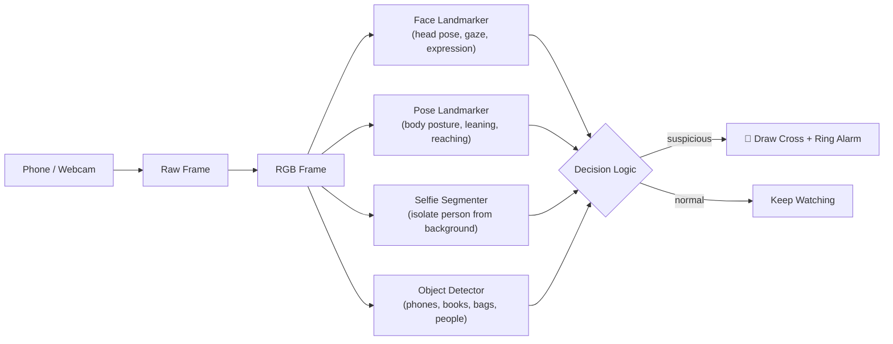
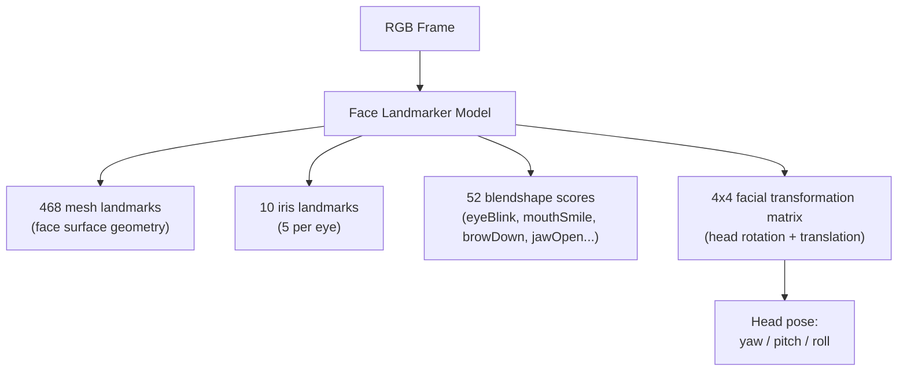
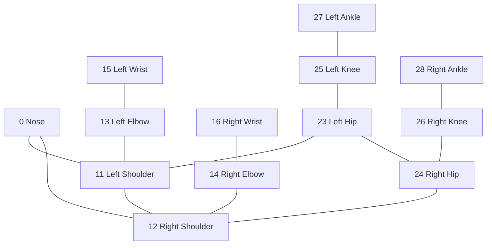
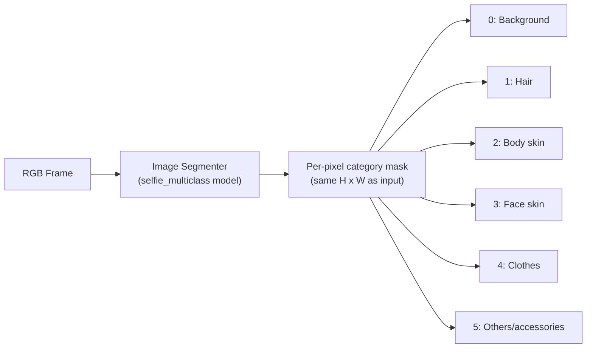
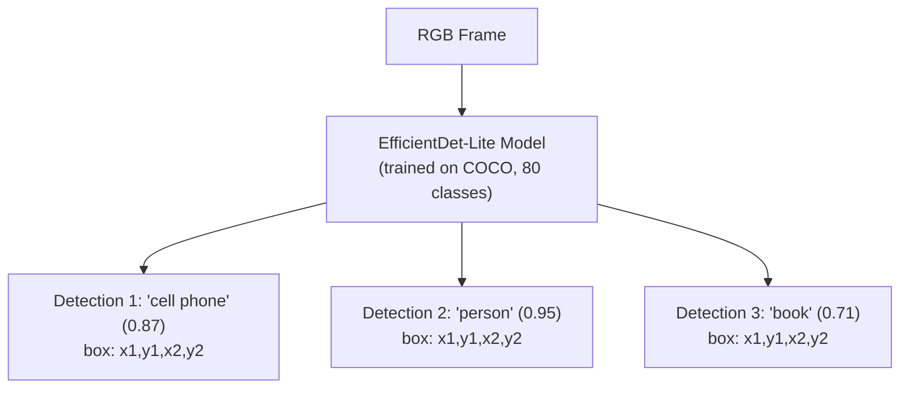
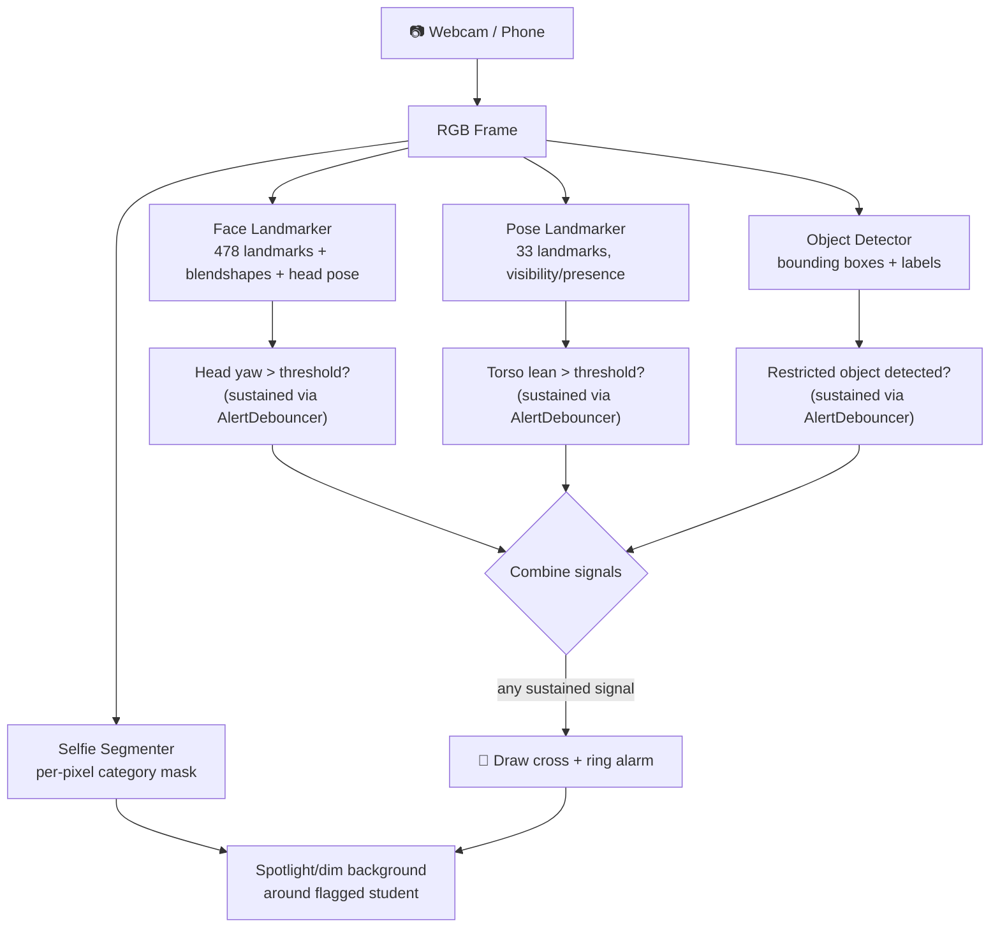

# MediaPipe From First Principles — Part 2
## Face Mesh → Full-Body Pose Detection → Selfie Segmentation/Augmentation → Object Detection

**By Gita — SEED ML**

> This is Document 2 of a 3-part series building toward a real capstone system: a **classroom monitoring tool** that captures live video from a phone, streams it to an office laptop, detects suspicious behavior, draws a marker (a "cross"/X) over the flagged student, and rings an alarm on the office computer.
>
> - **Doc 1:** Frames → Landmarks → Hand Landmarker → Gesture Recognition ✅ (done)
> - **Doc 2 (this one):** Face Landmarker/Mesh → Pose Landmarker → Selfie Segmentation → Object Detector
> - **Doc 3:** Capstone projects, including the classroom-cheating-alarm system
>
> If you skipped Doc 1: go back and read at least §4 ("The MediaPipe Tasks Architecture") first. Every task in this document reuses that exact same `BaseOptions → Options → create_from_options → detect` pattern, and this document will not re-explain it from scratch — it'll just point back to it.

---

### Where this document sits in the big picture



Doc 1 gave us **hands**. This document gives us **faces, whole bodies, backgrounds, and objects** — the last major sensing ingredients before Doc 3's capstone can reason about a whole classroom at once.

---

## 0. How This Document Is Structured (same rhythm as Doc 1)

1. **Concept** — first principles, no assumed prior knowledge beyond Doc 1.
2. **Diagram** — a Mermaid visual of the model's structure or pipeline.
3. **Why it matters for our capstone.**
4. **Code** — working, minimal examples (plus extended variants).
5. **Mini-project.**
6. **Checkpoint questions.**

Setup is identical to Doc 1 — same virtual environment, same `pip install mediapipe opencv-python numpy`. If you already have that environment from Doc 1, you don't need to do anything new.

---

## 1. Face Landmarker — 478 Points on a Human Face

### 1.1 The concept

The **Face Landmarker** task detects faces and, for each one, returns **478 3D landmarks**: **468 points** covering the entire face surface (jawline, eyebrows, lips, nose bridge, cheeks — the classic "face mesh") plus **10 additional iris points** (5 per eye), which is what lets you estimate precise eye/gaze position.

On top of the raw geometry, Face Landmarker can *optionally* output two extra things that make it far more useful than "just dots on a face":

- **Blendshapes** — 52 scores (0.0–1.0) representing facial-muscle-movement intensities, like `eyeBlinkLeft`, `mouthSmileRight`, `browDownLeft`, `jawOpen`. These are the same blendshape names used in Apple's ARKit, which is why this feature is so popular for AR filters and avatars.
- **Facial transformation matrix** — a 4×4 matrix describing the face's 3D rotation and translation in space. This is what lets you compute **head pose** (is the head turned left/right, tilted up/down) without hand-rolling any trigonometry yourself.



### 1.2 Why this matters for our capstone

This is arguably the **single most important sensor** for the classroom-alarm system. A student turning their head to look at a neighbor's paper, or looking down at a phone in their lap, shows up directly as a **head-pose change** — and we can detect that purely from the facial transformation matrix, without needing to guess from body posture alone. Combined with Pose Landmarker (§2) for body-level context, this gives us a strong "where is this student looking / leaning" signal.

### 1.3 Downloading the model

```bash
# Face Landmarker model bundle (includes blendshapes + transformation matrix support)
wget -O face_landmarker.task https://storage.googleapis.com/mediapipe-models/face_landmarker/face_landmarker/float16/1/face_landmarker.task
```

### 1.4 Code: detecting a face mesh with blendshapes on a webcam feed

```python
import cv2
import mediapipe as mp
from mediapipe.tasks import python
from mediapipe.tasks.python import vision
from mediapipe.framework.formats import landmark_pb2
from mediapipe import solutions

base_options = python.BaseOptions(model_asset_path='face_landmarker.task')
options = vision.FaceLandmarkerOptions(
    base_options=base_options,
    running_mode=vision.RunningMode.VIDEO,
    num_faces=1,
    output_face_blendshapes=True,
    output_facial_transformation_matrixes=True,
    min_face_detection_confidence=0.5,
)
detector = vision.FaceLandmarker.create_from_options(options)

cap = cv2.VideoCapture(0)
frame_timestamp_ms = 0

while cap.isOpened():
    success, frame = cap.read()
    if not success:
        break

    rgb_frame = cv2.cvtColor(frame, cv2.COLOR_BGR2RGB)
    mp_image = mp.Image(image_format=mp.ImageFormat.SRGB, data=rgb_frame)

    frame_timestamp_ms += 33
    result = detector.detect_for_video(mp_image, frame_timestamp_ms)

    if result.face_landmarks:
        for face_landmarks in result.face_landmarks:
            proto = landmark_pb2.NormalizedLandmarkList()
            proto.landmark.extend([
                landmark_pb2.NormalizedLandmark(x=lm.x, y=lm.y, z=lm.z)
                for lm in face_landmarks
            ])
            solutions.drawing_utils.draw_landmarks(
                image=frame,
                landmark_list=proto,
                connections=solutions.face_mesh.FACEMESH_TESSELATION,
                landmark_drawing_spec=None,
                connection_drawing_spec=solutions.drawing_styles
                    .get_default_face_mesh_tesselation_style())

    cv2.imshow("Face Landmarker", frame)
    if cv2.waitKey(1) & 0xFF == ord('q'):
        break

cap.release()
cv2.destroyAllWindows()
```

### 1.5 Extra code: reading blendshapes (is the student's mouth open? eyes closed?)

```python
def get_blendshape_score(result, name):
    """Look up a specific blendshape score by name, e.g. 'eyeBlinkLeft'."""
    if not result.face_blendshapes:
        return None
    for category in result.face_blendshapes[0]:
        if category.category_name == name:
            return category.score
    return None

# Usage inside the loop, after detect_for_video():
jaw_open = get_blendshape_score(result, "jawOpen")
eye_blink_l = get_blendshape_score(result, "eyeBlinkLeft")
eye_blink_r = get_blendshape_score(result, "eyeBlinkRight")

if jaw_open is not None and jaw_open > 0.5:
    print("Mouth is open — could indicate talking")

if eye_blink_l and eye_blink_r and eye_blink_l > 0.7 and eye_blink_r > 0.7:
    print("Both eyes closed — could indicate a prolonged blink or head-down posture")
```

Some other blendshape names worth knowing: `browDownLeft` / `browDownRight` (frowning), `mouthSmileLeft` / `mouthSmileRight`, `eyeLookOutLeft` / `eyeLookInLeft` (gaze direction), `mouthPucker`. The full list of 52 names ships inside every Face Landmarker result — just print `[c.category_name for c in result.face_blendshapes[0]]` once to see them all.

### 1.6 Extra code: estimating head pose (yaw) from the transformation matrix

Head yaw (turning left/right) is the single most useful signal for "is this student looking away from their own desk." We can extract it from the 4×4 facial transformation matrix using basic rotation-matrix math:

```python
import numpy as np

def get_head_yaw_degrees(result):
    """Extract approximate head yaw (left/right turn) in degrees
    from the facial transformation matrix. 0 = facing camera,
    positive = turned toward viewer's left, negative = toward viewer's right."""
    if not result.facial_transformation_matrixes:
        return None

    matrix = np.array(result.facial_transformation_matrixes[0]).reshape(4, 4)
    rotation = matrix[:3, :3]

    # Standard yaw extraction from a rotation matrix (Y-axis rotation)
    yaw_rad = np.arctan2(-rotation[2, 0],
                          np.sqrt(rotation[2, 1] ** 2 + rotation[2, 2] ** 2))
    return np.degrees(yaw_rad)

# Usage:
yaw = get_head_yaw_degrees(result)
if yaw is not None and abs(yaw) > 35:
    print(f"Head turned significantly ({yaw:.1f}°) — looking away from desk")
```

### 1.7 Mini-project 4: "Looking Away" Detector

Goal: combine blendshapes + head yaw into a single, sustained-attention flag — the direct forerunner of the classroom system's head-turn check.

**Task:**
1. Every frame, compute `yaw = get_head_yaw_degrees(result)`.
2. Reuse the `AlertDebouncer` class from Doc 1 §6.5b: feed it `abs(yaw) > 30` each frame.
3. When the debouncer confirms sustained head-turning (say, 15 consecutive frames ≈ half a second at 30 FPS), overlay red text: `"LOOKING AWAY"`.
4. Print the current yaw value on-screen every frame regardless, so you can calibrate the 30° threshold to your own webcam angle and seating position.

### Checkpoint questions
1. What are the two components of the 478 total face landmarks?
2. What is a blendshape, and name two blendshape names you could use to detect a yawn or an open mouth.
3. Why is the facial transformation matrix more reliable for measuring head rotation than trying to compute it manually from raw mesh landmark positions?
4. Why do we reuse the `AlertDebouncer` from Doc 1 instead of writing a new debounce mechanism for head-turn detection?

---

## 2. Pose Landmarker — Tracking the Whole Body (33 Points)

### 2.1 The concept

The **Pose Landmarker** detects a person's body and returns **33 landmarks** covering the whole skeleton: nose, eyes, ears, shoulders, elbows, wrists, fingers (approximate), hips, knees, ankles, and feet. Like every other MediaPipe landmark task, it returns both **image landmarks** (normalized `x, y, z`, plus a `visibility` and `presence` score per point) and **world landmarks** (3D real-world meters, origin at the midpoint of the hips).

The 33 points, grouped:

```
0: Nose
1-6:   Eyes & eye corners (inner/outer, left & right)
7-8:   Ears
9-10:  Mouth corners
11-12: Shoulders (left, right)
13-14: Elbows (left, right)
15-16: Wrists (left, right)
17-22: Hand detail (pinky, index, thumb — approximate, per hand)
23-24: Hips (left, right)
25-26: Knees (left, right)
27-28: Ankles (left, right)
29-32: Heels & foot index (per foot)
```

Two extra fields matter a lot in practice:

- **`visibility`** — how likely this landmark is actually visible (not occluded) in the frame.
- **`presence`** — how likely this landmark exists within the frame bounds at all.

Both range 0.0–1.0. Always check these before trusting a landmark's position — a low `visibility` score (e.g., a hand hidden behind a desk) means the reported `x, y` is the model's *best guess*, not a confident observation.



### 2.2 Model variants: Lite, Full, Heavy

Pose Landmarker ships in three sizes — a tradeoff you'll want to tune once you have several students in frame at once:

| Model | Relative speed | Relative accuracy | Good for |
|---|---|---|---|
| `pose_landmarker_lite` | Fastest | Lowest | Many people at once, low-power hardware |
| `pose_landmarker_full` | Balanced | Balanced | Most general use (recommended default) |
| `pose_landmarker_heavy` | Slowest | Highest | Single-person, accuracy-critical scenes |

```bash
# Full model (recommended starting point)
wget -O pose_landmarker.task https://storage.googleapis.com/mediapipe-models/pose_landmarker/pose_landmarker_full/float16/1/pose_landmarker_full.task

# Lite model (faster — good once we're tracking a whole classroom in Doc 3)
wget -O pose_landmarker_lite.task https://storage.googleapis.com/mediapipe-models/pose_landmarker/pose_landmarker_lite/float16/1/pose_landmarker_lite.task

# Heavy model (most accurate, slowest)
wget -O pose_landmarker_heavy.task https://storage.googleapis.com/mediapipe-models/pose_landmarker/pose_landmarker_heavy/float16/1/pose_landmarker_heavy.task
```

### 2.3 Why this matters for our capstone

Pose gives us **body-level** context that face alone can't: is a student leaning far sideways toward a neighbor's desk? Is an arm extended out to pass something? Combined with Face Landmarker's head-yaw signal, pose lets us build a much more robust "suspicious lean" rule than head-turn detection alone — a student could keep their face forward while leaning their whole torso sideways, and pose is what catches that.

### 2.4 Code: detecting body pose on a webcam feed

```python
import cv2
import mediapipe as mp
from mediapipe.tasks import python
from mediapipe.tasks.python import vision
from mediapipe.framework.formats import landmark_pb2
from mediapipe import solutions

base_options = python.BaseOptions(model_asset_path='pose_landmarker_full.task')
options = vision.PoseLandmarkerOptions(
    base_options=base_options,
    running_mode=vision.RunningMode.VIDEO,
    num_poses=1,
    min_pose_detection_confidence=0.5,
)
detector = vision.PoseLandmarker.create_from_options(options)

cap = cv2.VideoCapture(0)
frame_timestamp_ms = 0

while cap.isOpened():
    success, frame = cap.read()
    if not success:
        break

    rgb_frame = cv2.cvtColor(frame, cv2.COLOR_BGR2RGB)
    mp_image = mp.Image(image_format=mp.ImageFormat.SRGB, data=rgb_frame)

    frame_timestamp_ms += 33
    result = detector.detect_for_video(mp_image, frame_timestamp_ms)

    if result.pose_landmarks:
        for pose_landmarks in result.pose_landmarks:
            proto = landmark_pb2.NormalizedLandmarkList()
            proto.landmark.extend([
                landmark_pb2.NormalizedLandmark(x=lm.x, y=lm.y, z=lm.z)
                for lm in pose_landmarks
            ])
            solutions.drawing_utils.draw_landmarks(
                frame, proto, solutions.pose.POSE_CONNECTIONS)

    cv2.imshow("Pose Landmarker", frame)
    if cv2.waitKey(1) & 0xFF == ord('q'):
        break

cap.release()
cv2.destroyAllWindows()
```

### 2.5 Extra code: multi-person pose (tracking several students at once)

For the classroom capstone, we need more than one student tracked simultaneously. This is a one-line configuration change:

```python
options = vision.PoseLandmarkerOptions(
    base_options=python.BaseOptions(model_asset_path='pose_landmarker_lite.task'),
    running_mode=vision.RunningMode.VIDEO,
    num_poses=6,  # detect up to 6 people in frame
    min_pose_detection_confidence=0.5,
)
detector = vision.PoseLandmarker.create_from_options(options)

# ... later, in the loop ...
result = detector.detect_for_video(mp_image, frame_timestamp_ms)

# result.pose_landmarks is now a LIST of pose landmark sets — one per detected person
print(f"Detected {len(result.pose_landmarks)} people")
for person_index, pose_landmarks in enumerate(result.pose_landmarks):
    nose = pose_landmarks[0]
    print(f"  Person {person_index}: nose at ({nose.x:.2f}, {nose.y:.2f})")
```

Note that `num_poses > 1` costs more compute per frame — this is exactly why the `lite` model variant exists. We'll revisit performance tuning properly in Doc 3.

### 2.6 Extra code: detecting a sideways lean using shoulder-hip angle

Here's real geometry logic for "is this person leaning sideways" — a genuinely useful building block for the capstone's suspicious-lean rule:

```python
import math

def torso_lean_angle(pose_landmarks):
    """Returns the angle (in degrees) of the torso from vertical,
    using the midpoint of the shoulders and the midpoint of the hips.
    0 = perfectly upright. Larger values = more sideways lean."""
    left_shoulder, right_shoulder = pose_landmarks[11], pose_landmarks[12]
    left_hip, right_hip = pose_landmarks[23], pose_landmarks[24]

    shoulder_mid_x = (left_shoulder.x + right_shoulder.x) / 2
    shoulder_mid_y = (left_shoulder.y + right_shoulder.y) / 2
    hip_mid_x = (left_hip.x + right_hip.x) / 2
    hip_mid_y = (left_hip.y + right_hip.y) / 2

    dx = shoulder_mid_x - hip_mid_x
    dy = shoulder_mid_y - hip_mid_y

    # atan2(dx, dy) gives angle from vertical (dy-axis), in radians
    angle_rad = math.atan2(dx, -dy)  # -dy because image y grows downward
    return math.degrees(angle_rad)

# Usage:
if result.pose_landmarks:
    lean = torso_lean_angle(result.pose_landmarks[0])
    if abs(lean) > 20:
        print(f"Sideways lean detected: {lean:.1f}°")
```

### 2.7 Mini-project 5: Posture Monitor

Goal: build a live posture dashboard combining what you now know.

**Task:**
1. Run Pose Landmarker in `num_poses=1` mode on your webcam.
2. Compute and display, live, on-screen: torso lean angle (§2.6), and whether both wrists (landmarks 15, 16) have `visibility > 0.5` (i.e., hands are visible, not hidden under a desk).
3. Reuse `AlertDebouncer` again: if `abs(lean) > 20` sustained for 15 frames, print `"SUSTAINED LEAN"`.
4. **Stretch goal:** switch to `num_poses=3` and have two friends join you in frame — confirm you get independent lean angles per person.

### Checkpoint questions
1. How many landmarks does Pose Landmarker return, and what do the extra `visibility` and `presence` fields tell you that plain `x, y` doesn't?
2. Which pose model variant (lite/full/heavy) would you choose for tracking an entire classroom of 20+ students at once, and why?
3. Why does `torso_lean_angle()` use the *midpoint* of both shoulders and both hips instead of just one side?
4. What's the cost of setting `num_poses` higher than the number of people actually in frame?

---

## 3. Selfie Segmentation — Separating Person from Background

### 3.1 The concept

**Segmentation** is different from landmark detection. Instead of returning a small set of keypoints, a segmentation model classifies **every single pixel** in the frame into a category — most simply, "person" vs. "background." The output is a **mask**: a grayscale (or multi-channel) image the same size as your input frame, where each pixel's value represents the model's confidence that that pixel belongs to a given category.

MediaPipe's relevant task here is the **Image Segmenter**, used with a selfie-focused model. Two model choices exist:

- **`selfie_segmenter`** — binary: person vs. background (1 output class beyond background).
- **`selfie_multiclass_256x256`** — classifies each pixel into one of **6 categories**: background, hair, body-skin, face-skin, clothes, and others (accessories). This is the more modern, more capable option, and what we'll use here.



### 3.2 Why this matters for our capstone

Segmentation is the "augmentation" building block: virtual backgrounds, blurring, or highlighting a specific student. For our alarm system, its most practical use is **visually isolating a flagged student** — e.g., dimming everything in the frame *except* the person the rule engine has flagged, which makes the alert much easier for office staff to spot at a glance than a small red X alone. It's also a nice stepping stone toward the idea of "which pixels belong to which tracked person," relevant once Doc 3 needs to associate a face+pose+object detection with the *same* individual.

### 3.3 Downloading the model

```bash
# Multiclass selfie segmenter (background, hair, body-skin, face-skin, clothes, other)
wget -O selfie_multiclass.tflite https://storage.googleapis.com/mediapipe-models/image_segmenter/selfie_multiclass_256x256/float32/latest/selfie_multiclass_256x256.tflite
```

### 3.4 Code: real-time background blur (classic selfie augmentation)

```python
import cv2
import numpy as np
import mediapipe as mp
from mediapipe.tasks import python
from mediapipe.tasks.python import vision

base_options = python.BaseOptions(model_asset_path='selfie_multiclass.tflite')
options = vision.ImageSegmenterOptions(
    base_options=base_options,
    running_mode=vision.RunningMode.VIDEO,
    output_category_mask=True,
)
segmenter = vision.ImageSegmenter.create_from_options(options)

cap = cv2.VideoCapture(0)
frame_timestamp_ms = 0
BACKGROUND_CATEGORY = 0  # index 0 = background in the multiclass model

while cap.isOpened():
    success, frame = cap.read()
    if not success:
        break

    rgb_frame = cv2.cvtColor(frame, cv2.COLOR_BGR2RGB)
    mp_image = mp.Image(image_format=mp.ImageFormat.SRGB, data=rgb_frame)

    frame_timestamp_ms += 33
    result = segmenter.segment_for_video(mp_image, frame_timestamp_ms)

    category_mask = result.category_mask.numpy_view()  # shape (H, W), int category per pixel
    is_background = (category_mask == BACKGROUND_CATEGORY)

    blurred = cv2.GaussianBlur(frame, (55, 55), 0)

    # Wherever the mask says "background", use the blurred pixel; otherwise the original
    output_frame = np.where(is_background[..., None], blurred, frame)

    cv2.imshow("Background Blur", output_frame.astype(np.uint8))
    if cv2.waitKey(1) & 0xFF == ord('q'):
        break

cap.release()
cv2.destroyAllWindows()
```

### 3.5 Extra code: "spotlight" a specific region (preview of flagging a student)

This is the pattern we'll reuse directly in Doc 3 — dim everything except a specific bounding region of interest:

```python
import cv2
import numpy as np

def spotlight_region(frame, category_mask, background_category=0, dim_factor=0.25):
    """Dims the background (or any masked-out category) while keeping
    the foreground person at full brightness — a 'spotlight' effect."""
    is_foreground = (category_mask != background_category)
    dimmed = (frame.astype(np.float32) * dim_factor).astype(np.uint8)
    output = np.where(is_foreground[..., None], frame, dimmed)
    return output

# Usage:
# category_mask = result.category_mask.numpy_view()
# spotlighted = spotlight_region(frame, category_mask)
# cv2.imshow("Spotlight", spotlighted)
```

**Why this matters directly for Doc 3:** once we combine segmentation with a bounding box from pose or object detection (e.g., "this is student #3's region"), we can dim the *entire rest of the classroom frame* except the flagged student — a much stronger visual cue for office staff than a small cross alone.

### 3.6 Mini-project 6: Virtual Background Swap

Goal: replace your background with a solid color or a static image, the classic "virtual green screen" effect — no green screen required.

**Task:**
1. Load a static background image (any `.jpg`/`.png`, resized to match your webcam's frame dimensions).
2. Every frame, use the category mask to composite: foreground pixels (you) from the live frame, background pixels from the static image.
3. **Stretch goal:** switch from a static image to a solid color fill, and make the color configurable via a keyboard press (e.g., `r` for red, `g` for green, `b` for blue).

### Checkpoint questions
1. What is the fundamental difference between a landmark task's output and a segmentation task's output?
2. Name the 6 categories the `selfie_multiclass_256x256` model classifies pixels into.
3. Why might "spotlighting" a flagged student be a more effective visual alert than just drawing a small cross over them?
4. If you wanted to know precisely where a person's hair vs. face-skin pixels are (not just "person" vs. "background"), which segmentation model would you use, and why?

---

## 4. Object Detector — Finding Things in the Frame

### 4.1 The concept

Unlike landmark tasks (which assume a known structure — a hand, a face, a body — and predict fixed points on it), **Object Detection** is general-purpose: given a frame, find **any number of objects** from a known category list, and return a **bounding box** (rectangle) plus a **category label** and **confidence score** for each one. There's no fixed landmark count here — a frame might contain 0 objects or 40.

MediaPipe's Object Detector uses the **EfficientDet-Lite** family of models, trained on the **COCO dataset** — a large public dataset with **80 everyday object categories** (person, cell phone, book, backpack, laptop, chair, bottle, and so on).



### 4.2 Model size tradeoffs

| Model | Input size | Speed | Accuracy |
|---|---|---|---|
| `efficientdet_lite0` | 320×320 | Fastest | Good baseline — recommended default |
| `efficientdet_lite2` | 448×448 | Slower | More accurate, heavier |

```bash
# EfficientDet-Lite0 (recommended starting point — int8 quantized, fast)
wget -O efficientdet.tflite https://storage.googleapis.com/mediapipe-models/object_detector/efficientdet_lite0/int8/1/efficientdet_lite0.tflite
```

### 4.3 Why this matters for our capstone

This is the ingredient that turns our system from "is a student's body posture unusual" into "is there an actual **phone** or **unauthorized paper** visible on a desk." Object Detection is what lets the alarm system reason about *what a student is interacting with*, not just how their body is positioned — the two together (pose/face for behavior, object detection for what's in-hand) are far more reliable than either alone.

A practical note: the stock EfficientDet-Lite model's 80 COCO categories **do include `cell phone` and `book`**, which is genuinely useful out of the box — but they do **not** include a category for "handwritten cheat sheet" or "folded note." For that level of specificity, you'd eventually train a **custom** object detector with MediaPipe Model Maker (mentioned in §4.6) on your own labeled photos — a good Doc 3 extension exercise, not something we need to do to get a working first version.

### 4.4 Code: real-time object detection on a webcam feed

```python
import cv2
import mediapipe as mp
from mediapipe.tasks import python
from mediapipe.tasks.python import vision

base_options = python.BaseOptions(model_asset_path='efficientdet.tflite')
options = vision.ObjectDetectorOptions(
    base_options=base_options,
    running_mode=vision.RunningMode.VIDEO,
    max_results=10,
    score_threshold=0.5,
)
detector = vision.ObjectDetector.create_from_options(options)

cap = cv2.VideoCapture(0)
frame_timestamp_ms = 0

while cap.isOpened():
    success, frame = cap.read()
    if not success:
        break

    rgb_frame = cv2.cvtColor(frame, cv2.COLOR_BGR2RGB)
    mp_image = mp.Image(image_format=mp.ImageFormat.SRGB, data=rgb_frame)

    frame_timestamp_ms += 33
    result = detector.detect_for_video(mp_image, frame_timestamp_ms)

    for detection in result.detections:
        bbox = detection.bounding_box
        category = detection.categories[0]
        label = category.category_name
        score = category.score

        start_point = (bbox.origin_x, bbox.origin_y)
        end_point = (bbox.origin_x + bbox.width, bbox.origin_y + bbox.height)
        cv2.rectangle(frame, start_point, end_point, (0, 255, 0), 2)
        cv2.putText(frame, f"{label} ({score:.2f})",
                    (bbox.origin_x, bbox.origin_y - 10),
                    cv2.FONT_HERSHEY_SIMPLEX, 0.6, (0, 255, 0), 2)

    cv2.imshow("Object Detector", frame)
    if cv2.waitKey(1) & 0xFF == ord('q'):
        break

cap.release()
cv2.destroyAllWindows()
```

Notice that object detection results use **pixel coordinates directly** (`origin_x`, `origin_y`, `width`, `height`) rather than normalized `[0,1]` coordinates like landmark tasks do — a genuinely different convention worth remembering when you mix object detection with landmark-based logic in Doc 3.

### 4.5 Extra code: filtering to only the categories we care about

For the capstone, we don't need all 80 COCO categories — just a handful. `category_allowlist` filters at the model level (faster than filtering in Python afterward):

```python
options = vision.ObjectDetectorOptions(
    base_options=python.BaseOptions(model_asset_path='efficientdet.tflite'),
    running_mode=vision.RunningMode.VIDEO,
    max_results=10,
    score_threshold=0.5,
    category_allowlist=["cell phone", "book", "person", "backpack"],
)
detector = vision.ObjectDetector.create_from_options(options)
```

### 4.6 Extra code: does an object overlap a specific person's region?

A crucial building block for Doc 3: given an object detection's bounding box and a pose landmarker's wrist position, check whether they're close enough to say "this object is in this person's hand."

```python
def point_in_or_near_box(point_x_px, point_y_px, bbox, margin_px=40):
    """Checks if a pixel point is inside a bounding box, expanded by `margin_px`
    on every side (a little slack accounts for detection jitter)."""
    x1 = bbox.origin_x - margin_px
    y1 = bbox.origin_y - margin_px
    x2 = bbox.origin_x + bbox.width + margin_px
    y2 = bbox.origin_y + bbox.height + margin_px
    return x1 <= point_x_px <= x2 and y1 <= point_y_px <= y2

# Usage: combining Pose Landmarker's wrist with Object Detector's bounding boxes
# h, w, _ = frame.shape
# wrist = pose_result.pose_landmarks[0][15]  # left wrist
# wrist_px = (int(wrist.x * w), int(wrist.y * h))
#
# for detection in object_result.detections:
#     if detection.categories[0].category_name == "cell phone":
#         if point_in_or_near_box(*wrist_px, detection.bounding_box):
#             print("Phone detected near student's hand!")
```

This is genuinely the crux of the Doc 3 capstone logic: **fusing** two different task outputs (pose landmarks + object detections) into one rule. Every task in this document produces slightly different output shapes (normalized vs. pixel coordinates, points vs. boxes), and writing small "glue" functions like this one is most of the real engineering work in a multi-model system.

### 4.7 Custom object categories via Model Maker

Just like Doc 1's Gesture Recognizer, MediaPipe's **Model Maker** (`mediapipe-model-maker` package) supports fine-tuning an EfficientDet-Lite model on your **own labeled images** — useful if you eventually want a category like "handwritten note" or a specific unauthorized item your school cares about. This requires a labeled image dataset (even a small one, on the order of a few hundred images, can work reasonably well via transfer learning) and is a natural Doc 3 extension once the core pipeline is working with the stock 80 COCO categories.

### 4.8 Mini-project 7: "Phone on Desk" Detector

Goal: build the direct forerunner of the capstone's object-based alert.

**Task:**
1. Run Object Detector with `category_allowlist=["cell phone"]`.
2. Reuse `AlertDebouncer`: trigger only after a phone has been continuously detected for, say, 45 frames (~1.5 seconds at 30 FPS) — long enough to rule out a hand quickly passing through frame.
3. When triggered, draw the red cross (Doc 1 §6) over the phone's bounding box specifically, not the whole frame.
4. Print the phone's bounding box coordinates and confidence score to the console each time it triggers.

### Checkpoint questions
1. Why does Object Detector return pixel coordinates directly instead of normalized `[0,1]` coordinates like landmark tasks do?
2. What is `category_allowlist` for, and why filter at the model-options level instead of after detection in plain Python?
3. Give an example of a real-world object your school might care about that would **not** be reliably detected by the stock EfficientDet-Lite model, and what tool would let you add it?
4. In `point_in_or_near_box()`, why do we add a `margin_px` slack instead of requiring an exact overlap?

---

## 5. Common Pitfalls (New Ones, Specific to This Document)

- **Assuming segmentation masks are pixel-accurate on hair/fine edges.** Selfie segmentation is good for backgrounds and rough person outlines but will visibly wobble around hair strands and fine details frame to frame — don't build logic that depends on pixel-perfect edges.
- **Mixing coordinate conventions.** Landmark tasks (Face, Pose) return **normalized `[0,1]`** coordinates; Object Detector returns **pixel** coordinates directly. If you're combining them (§4.6), convert landmarks to pixels first — forgetting this is an easy silent bug (your "is the phone near the wrist" check will just always evaluate false).
- **Forgetting `visibility`/`presence` on pose landmarks.** A landmark for an occluded body part (e.g., a wrist behind a desk) still gets *some* `x, y` value — the model extrapolates. Always gate logic on `visibility > 0.5` (or similar) rather than trusting every landmark blindly.
- **Running too many heavy models at once without profiling.** Face + Pose + Segmentation + Object Detection, all at `heavy`/`full` size, on every frame, will bring most laptops to a crawl. Doc 3 covers strategies (frame skipping, using `lite` variants, running detection at a lower resolution) for making a multi-model pipeline actually real-time.
- **Treating COCO's 80 classes as exhaustive.** If your object of interest isn't in the list (search "COCO 80 categories" if unsure), the stock model simply won't detect it — you need Model Maker (§4.7) or a workaround (e.g., detecting "cell phone" as a proxy, or falling back to pose/hand-based heuristics).

---

## 6. Full Recap Diagram: Everything in This Document, End to End



Every box maps directly to a section:

| Box | Section |
|---|---|
| Face Landmarker, blendshapes, head yaw | §1 |
| Pose Landmarker, lean angle | §2 |
| Selfie Segmenter, spotlighting | §3 |
| Object Detector, allowlist, wrist-proximity fusion | §4 |

---

## 7. What You Should Be Able to Do Now

Before moving to Document 3, make sure you can, without looking anything up:

- [ ] Explain the difference between the 468 mesh points and the 10 iris points in Face Landmarker's 478 total.
- [ ] Read a blendshape score and use it in a threshold-based rule.
- [ ] Extract head yaw from the facial transformation matrix.
- [ ] List the 33 pose landmark groups and explain what `visibility`/`presence` add beyond `x, y`.
- [ ] Compute a torso lean angle from shoulder and hip landmarks.
- [ ] Explain the difference between a landmark task's output and a segmentation task's per-pixel mask.
- [ ] Run background blur or a virtual background swap using a selfie segmentation mask.
- [ ] Run Object Detector, filter with `category_allowlist`, and read bounding boxes in pixel coordinates.
- [ ] Combine a pose landmark (normalized) with an object detection box (pixel) by converting coordinate spaces correctly.
- [ ] Explain why running many heavy models per frame is a real performance concern, and name at least one mitigation.

---

## 8. Where We're Headed (Doc 3 Preview)

In Document 3, we stop learning individual tasks and start **building the actual system**:

- **Phone-to-laptop live streaming** — getting a real phone camera's video onto the office laptop (IP webcam apps, RTSP, or a simple socket-based stream), replacing `cv2.VideoCapture(0)` with a network video source.
- **Multi-person tracking** — assigning stable IDs to each detected student across frames, so "student #3 leaned sideways" stays consistent frame to frame instead of resetting every detection.
- **The rule engine** — fusing head yaw (§1), torso lean (§2), and restricted-object proximity (§4) into one confidence-weighted "suspicious behavior" score, with the `AlertDebouncer` pattern from Doc 1 protecting against false alarms.
- **The alarm** — playing an audible sound on the office laptop the moment a sustained alert fires (using a simple Python audio library).
- **The overlay** — drawing the red cross over the *specific flagged student's* bounding region (not the whole frame), optionally combined with the §3.5 spotlight effect.
- **Performance tuning** — frame skipping, resolution downscaling, and choosing lite vs. full vs. heavy models so the whole pipeline runs smoothly in real time on ordinary laptop hardware.
- **Ethical and practical considerations** — a short, honest discussion of the privacy, fairness, and false-positive implications of a system like this, and why human judgment should stay firmly in the loop before any consequence is applied to a real student.

---

*End of Document 2 — Face Mesh, Pose Detection, Selfie Segmentation & Object Detection.*
